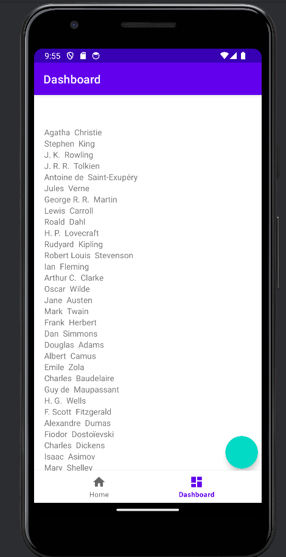

Projet ABC - Android Books Client
=================================

L'objectif de ce projet est de réaliser un client mobile pour l'API Books développée dans le module W41. 
Dans ce module, nous avons aborder le développement d'une API à l'aide de NodeJs. Nous avons donc utilisé cette API pour récupérer les informations nécessaires à l'application.
Sans cette API, l'application ne sera donc évidemment pas fonctionnelle.

La première partie de ce README correspond au sujet que nous avions pour réaliser ce projet. 
La deuxième partie correspond à une présentation du travail qui à été réalisé.
(Le projet à été effectué en groupe de  deux personnes sur une durée d'envireon 1 mois. Il est important de prendre en compte que pendant ce mois nous avions d'autres projets d'envergure similaire à préparer en parallèle.)

Première Partie
================

Rendu
-----

- Quand ? **le 8 avril à 0h00** (ou le 7 avril à 24h00, au choix)
- Où ? Sur votre dépôt Git.
- Quoi ?
    - Le code de l'application
    - Un rapport expliquant votre architecture, ce qui est censé fonctionner et ne pas fonctionner, les difficultés que vous avez rencontré.

Fonctionnalités
---------------

L'application doit proposer un certain nombre de fonctionnalités :

- **Afficher la liste des livres** : lorsqu'un livre est sélectionné, la description de ce livre doit s'afficher, dont les tags, la note moyenne et les commentaires.
- **Afficher la liste des auteurs** : lorsqu'un auteur est sélectionné, la liste des titres des livres qu'il a écrit doit s'afficher. Un clic sur l'un des livres doit afficher ses détails.
- **Créer un livre** à partir d'un formulaire
- **Supprimer un livre** depuis sa page de description
- **Créer un auteur** à partir d'un formulaire
- **Supprimer un auteur** (et les livres associés) depuis sa page de description

Bonus : L'application peut permettre d'**associer une couverture à un livre**, mais uniquement localement. L'image est stockée sur le téléphone, pas sur le serveur.

Interface
---------

1. L'application est composée d'**une seule activité principale**. Cette activité contiendra une **[`Bottom Navigation Activity`](https://developer.android.com/studio/projects/templates#BottomNavActivity)**.
1. L'écran d'accueil de l'application affiche la liste des livres.
1. Les listes des livres et des auteurs sont affichées dans des **`RecyclerView`**.
1. Lors d'un **clic sur un livre**, ses informations sont affichées dans un nouveau fragment.
1. Lors d'un **clic sur un auteur**, les livres de cet auteur sont affichés dans un nouveau fragment.
1. La **création des livres et des auteurs** doit être proposée à partir de [FABs](https://developer.android.com/develop/ui/views/components/floating-action-button) présents respectivement sur la liste des livres et des auteurs.

Pour gérer les **clics sur les items d'un `RecyclerView`**, vous pouvez vous référer à [ce site](https://www.codexpedia.com/android/defining-item-click-listener-for-recyclerview-in-android/) ou [celui-ci](https://dev.to/theplebdev/adding-onclicklistener-to-recyclerview-in-android-3amb).

Conseils
--------

- Travaillez dans un premier temps avec **des données "en dur"**, sans communication avec l'API
- C'est un projet assez conséquent, l'essentiel n'est pas d'implémenter toutes les fonctionnalités mais d'**implémenter "proprement"** celles que vous aurez le temps de faire.

Deuxième Partie
================

Je vais ici principalement montrer des captures d'écrans de l'application rendue.
Je vous renvoie vers le fichier [Rapport.md](./Rapport.md) pour les informations concernant les fonctionnalités de l'application lors de la remise du projet.

La première Capture d'écran représente la liste des auteurs : 

Cette deuxième capture d'écran montre la vue obtenue en cliquant sur un auteur avec la liste des livres qu'il a écrit : 

Enfin voici la vue d'un livre, s'affichant lorsqu'un livre est cliqué, que ce soit dans la vue d'un auteur ou la liste des livres : 

Comme dit dans le rapport, l'applicaiton respecte l'architecture MVVM. Notre objectif était de respecter tous ses concepts et d'avoir un fond irréprochable d'un point de vue structure.
